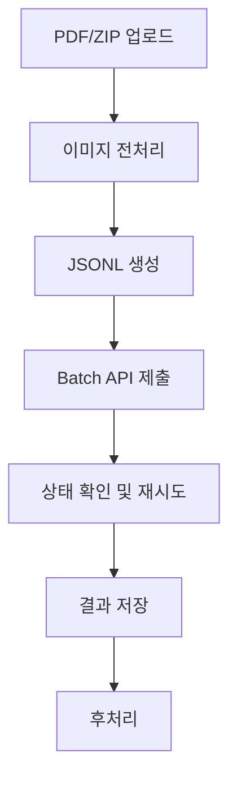
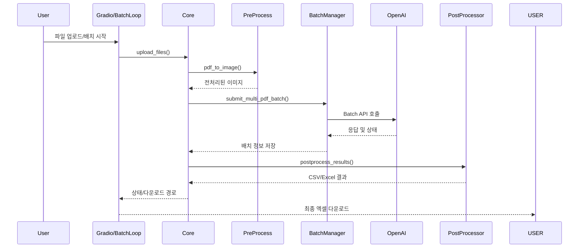

# pdf IE(information Extraction)

Gradio UI를 통한 손쉬운 사용 방법과 `batch_loop.py`를 이용한 대량 배치 처리 방식 두 가지를 모두 다룹니다.

## 1. 필요한 하드웨어 및 소프트웨어

### 권장 하드웨어
- CPU 코어 4개 이상
- 메모리 8GB 이상 (대용량 PDF 처리 시 16GB 이상 권장)
- 여유 디스크 공간 10GB 이상 (대용량 PDF 처리 시 50GB 이상 권장)

### 필수 소프트웨어 및 패키지
- Python 3.10+
- `pip install -r requirements.txt` 로 설치 가능한 패키지
- OS는 Windows/Linux/MacOS 모두 가능

## 2. 설치 및 초기 설정
1. 저장소 클론 후 `install.py` 스크립트를 실행하면 필요한 디렉터리가 생성됩니다.
2. `requirements.txt`를 이용하여 의존 패키지를 설치합니다.
3. 프로젝트 루트에 `.env` 파일을 만들고 `OPENAI_API_KEY` 값을 입력합니다.

```bash
python install.py
pip install -r requirements.txt
```

## 3. 사용 방법
### 3.1 Gradio UI 사용
`gradio_ui.py`를 실행하면 웹 인터페이스가 열립니다. PDF 업로드, 배치 생성, 상태 조회, 결과 다운로드를 한 번에 진행할 수 있어 초보자에게 추천되는 방식입니다.

```bash
python gradio_ui.py
```

### 3.2 batch_loop 방식
대량의 PDF가 폴더 구조로 정리되어 있을 때 `batch_loop.py`를 사용하면 자동으로 모든 파일을 업로드하고 결과가 나올 때까지 반복 처리합니다.


```bash
python batch_loop.py --work_path <PDF_폴더경로>
```

## 4. dir 구조
```
.
├── README.md
├── requirements.txt
├── batch_loop.py  # 전체 자동 프레세스를 위한 executor
├── gradio_ui.py   # UI 를 통해 100건 이하의 pdf를 직관적으로 실행 시킬 수 있는 UI 실행 후 127.0.0.1:7860 으로 확인
├── install.py     # 초기 설정 py
├── docs/          # 기타 문서서
│   └── DETAIL_GUIDE_KR.md
├── app/           # 실제 python 코드 패키지
│   ├── core.py    # 내부 모듈 컨트롤러
│   ├── post_processor_run.py  # post_process를 multhprocess로 처리 하기 위한 runner
│   ├── IOmanager/ # 모든 내/외부 IO 작업 진행 모듈 
│   │   ├── batch_manager.py  # OPENAI IO 담당
│   │   ├── file_upload.py    # User의 file upload 처리
│   │   └── meta_manager.py   # meta data 관리
│   ├── config/        
│   │   ├── .env       # 보안성이 필요한 openai key 존재재
│   │   └── config.py  # 모든 설정 사항으로, prompt 및 dir, openai key등에 대한 설정 
│   └── processor/     # 전/후 처리에 필요한 모듈
│       ├── pre_processor.py
│       └── post_processor.py
├── data/  
    ├── batch_results/   OPEN AI 배치 결과 JSONL 저장장
    ├── meta_info/
    |   ├── batch_meta.jsonl  # 진행한 파일들에 대한 모든 meta 정보 저장
    |   ├── file_code.json    # 진행한 파일에 대한 raw_name, code_name 저장
    ├── temp/     # 파일 업로드를 위한 임시 저장소소
    └──temp_work_dir/ # 모든 내/외부 IO 작업 진행 모듈 
       ├── pre_processed  # 이미지 전처리, batch로드를 위한 jsonl 임시 저장
       └── raw            # temp -> raw로 코드명으로 변환된 pdf 임시 저장 
```
## 4. 파이프라인 개요




각 단계는 다음과 같은 모듈에서 수행합니다.
- `FileUploader` : 파일 업로드 및 중복 검사
- `BatchManager` : 전처리, JSONL 생성, Batch API 제출
- `MetaManager` : 배치 상태와 파일 매핑 저장
- `PostProcessor` : 응답(JSONL)을 CSV/Excel로 변환

## 5. 모듈 연결 시퀀스

아래 시퀀스 다이어그램은 Gradio UI 또는 배치 스크립트가 어떻게 각 모듈을 호출하는지 보여줍니다.



## 6. 전처리(Image PreProcess) 상세

스캔된 PDF를 이미지로 변환하고 모델 입력에 맞게 슬라이스 하는 단계입니다.

### 핵심 파라미터
- `CROP_TOP` / `CROP_BOTTOM` : 상단과 하단 여백을 잘라 불필요한 이미지(토큰)을 축소시켜 비용을 최소화 합니다.
- `CROP_OVERLAP` : 슬라이딩 윈도우가 서로 겹치는 픽셀 수로, 행이 경계에서 끊기지 않게 충분히 크게 설정합니다. 기본값은 60입니다. 
- `INDEX_OFFSET` : PDF 페이지 번호와 실제 저장 파일 번호를 맞추기 위한 보정값입니다. (예: 7)
- `max_workers` : `pdf_to_image`에서 동시에 처리할 스레드 수로, 시스템의 CPU 코어 수에 맞춰 조정합니다.
- `dpi` : PDF 렌더링 해상도로 기본 400dpi를 사용해 글자가 충분히 선명하게 유지됩니다.

### 처리 절차
1. `pixmap_to_np`로 PDF 페이지를 NumPy 배열로 변환합니다.
2. `clean_and_crop_binary_image_cv2_from_np`에서 이진화 → 노이즈 제거 → 테이블 선 강조 → 내용 영역 Crop을 순차적으로 수행합니다.
3. 한 페이지를 좌/우로 나눈 뒤 `vertical_sliding_window`를 이용해 세 부분씩 저장해 모델 입력 크기에 맞춥니다.
4. Mulithreading을 사용하여 작업 속도를 최대한 줄였으며, 개발 pc의 성능에 맞추어 6으로 설정 되어있습니다. 컴퓨터 성능에 따라 변경 가능합니다. 

## 7. LLM 프로세스(OpenAI Batch API)
- 전처리된 이미지들은 페이지 타입별로 묶여 JSONL 형식의 요청 파일로 변환됩니다.
- 각 페이지 타입에 대해 `config.py`의 `PROMPT_MAPPING`에서 정의된 프롬프트가 사용됩니다. 프롬프트에는 테이블 구조와 추출 규칙이 상세히 명시되어 있어 모델이 일관된 JSON 결과를 반환하도록 합니다.
- 생성된 JSONL 파일은 `OpenAI` 라이브러리로 Batch API에 제출되며, 완료 상태가 될 때까지 주기적으로 확인합니다.
- 각 호출을 multithreading을 사용하여 IO 속도를 최대한 늘렸으며, openai api의 제한인 최대 15건의 제한으로 10건으로 설정하여 오류를 최소화하였습니다. 

### 프롬프트의 강점
input 데이터에 대한 상세한 설명, regulation, 반환값에 대한 정보를 상세하게 기술 하였으며, llm의 성능 유지를 확고하게 하기 위해 영문으로 작성되어있습니다. 
프롬프트에는 컬럼 순서, 데이터 타입, 오탈자 처리 규칙 등이 구체적으로 기술되어 있습니다. 따라서 모델은 표의 물리적 구조를 그대로 유지한 JSON을 생성하게 됩니다.

만약 모델이 불완전한 JSON을 반환하더라도 `json_repair` 라이브러리로 구조를 복구하여 후처리 단계에서 사용합니다.

## 8. 후처리(PostProcess)
- Batch API 응답 파일(JSONL)을 읽어 테이블 단위의 CSV로 변환합니다.
- CSV 파일들은 `combine_to_excel` 메서드를 통해 하나의 Excel 파일로 병합됩니다.
- 잘못된 JSON 형식이나 누락된 필드는 `repair_json` 및 `detect_nulls` 로직으로 보정합니다.
- 후처리 완료 후 임시 이미지·PDF·메타 파일을 정리하여 저장 공간을 확보합니다.

## 9. 모듈 요약
자세한 함수 설명은 `docs/DETAIL_GUIDE_KR.md` 문서에서 확인할 수 있습니다. 여기서는 각 모듈의 역할을 간단히 소개합니다.

### 9.1 `app/core.py`
파일 업로드부터 배치 실행, 후처리까지 전체 흐름을 조율하는 컨트롤러 클래스입니다.

### 9.2 `app/IOmanager/file_upload.py`
업로드된 PDF/ZIP 파일을 임시 폴더로 이동시키고 중복 여부를 검사합니다.

### 9.3 `app/IOmanager/batch_manager.py`
PDF를 이미지로 변환하여 Batch API 요청을 만들고 결과를 다운로드합니다.

### 9.4 `app/IOmanager/meta_manager.py`
배치 메타 데이터와 파일 매핑 정보를 저장하고 갱신합니다.

### 9.5 `app/processor/pre_processor.py`
PDF 페이지를 이진화한 뒤 슬라이딩 윈도우 방식으로 분할합니다.

### 9.6 `app/processor/post_processor.py`
Batch 결과(JSONL)를 테이블별 CSV/Excel로 변환하고 불필요한 파일을 정리합니다.

### 9.7 사용자 인터페이스 스크립트
- `gradio_ui.py`: 웹 UI를 통해 파일 업로드와 배치 실행을 지원합니다.
- `batch_loop.py`: 폴더 구조를 순회하며 자동으로 배치를 처리합니다.

## 10. 설정 파일
`app/config/config.py`에서 데이터 경로와 페이지 타입 매핑, 추출 프롬프트 등이 정의되어 있습니다. 필요에 따라 PDF/이미지/결과 저장 위치를 변경하거나 프롬프트 내용을 수정할 수 있습니다.

## 11. 참고
프로젝트 구조나 동작 방식에 대한 추가 질문이 있다면 각 파이썬 파일의 주석을 확인하거나 코드를 직접 열람해 보시기 바랍니다. 배치 API 사용 요금과 제한 사항은 OpenAI 문서를 참고하세요.
