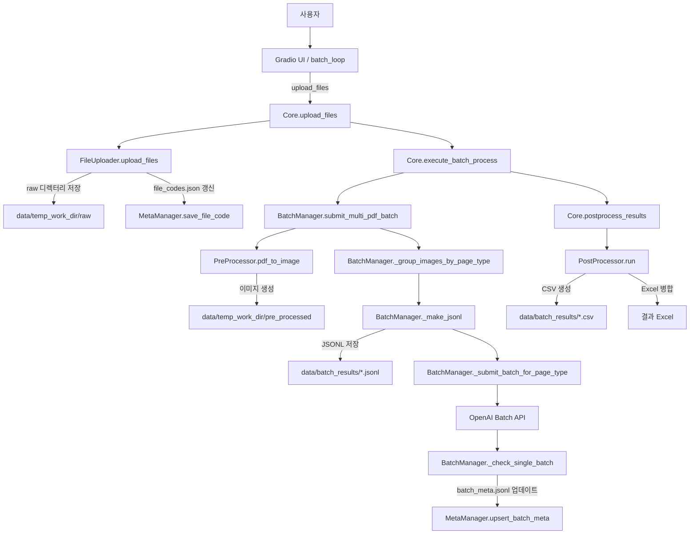

# 프로젝트 코드 상세 설명

## DRI 구조
.
├── README.md
├── requirements.txt
├── batch_loop.py  # 전체 자동 프레세스를 위한 executor
├── gradio_ui.py   # UI 를 통해 100건 이하의 pdf를 직관적으로 실행 시킬 수 있는 UI 실행 후 127.0.0.1:7860 으로 확인
├── install.py     # 초기 설정 py
├── app/           # 실제 python 코드 패키지
│   ├── core.py    # 내부 모듈 컨트롤러
│   ├── post_processor_run.py  # post_process를 multhprocess로 처리 하기 위한 runner
│   ├── IOmanager/ # 모든 내/외부 IO 작업 진행 모듈 
│   │   ├── batch_manager.py  # OPENAI IO 담당
│   │   ├── file_upload.py    # User의 file upload 처리
│   │   └── meta_manager.py   # meta data 관리
│   ├── config/        
│   │   ├── .env       # 보안성이 필요한 openai key 존재재
│   │   └── config.py  # 모든 설정 사항으로, prompt 및 dir, openai key등에 대한 설정 
│   └── processor/     # 전/후 처리에 필요한 모듈
│       ├── pre_processor.py
│       └── post_processor.py
├── data/  
    ├── batch_results/   OPEN AI 배치 결과 JSONL 저장장
    ├── meta_info/
    |   ├── batch_meta.jsonl  # 진행한 파일들에 대한 모든 meta 정보 저장
    |   ├── file_code.json    # 진행한 파일에 대한 raw_name, code_name 저장
    ├── temp/     # 파일 업로드를 위한 임시 저장소소
    └──temp_work_dir/ # 모든 내/외부 IO 작업 진행 모듈 
       ├── pre_processed  # 이미지 전처리, batch로드를 위한 jsonl 임시 저장
       └── raw            # temp -> raw로 코드명으로 변환된 pdf 임시 저장 

## 각 모듈 내 함수 별 상세 설명

### app/core.py
- **upload_files(upload_files, project, group_id)**: 업로드된 파일 스트림을 `FileUploader.upload_files`에 전달하여 임시 폴더로 복사하고 중복 여부를 판단합니다. 새로 등록된 파일은 코드명으로 저장되며 처리 결과 리스트를 돌려줍니다.
- **execute_batch_process(pdf_list_chunk, project)**: 입력 파일 목록 청크를 받아 새로운 배치 그룹 ID를 생성한 후 `BatchManager.submit_multi_pdf_batch`를 호출하여 이미지 전처리 및 Batch API 제출을 수행합니다.
- **status_update()**: `check_batches`로 현재 배치 상태를 갱신하고, 누락된 결과는 `rerun`으로 다시 조회하며, 실패한 배치는 `retry_failed_batches`로 재제출합니다.
- **get_status()**: `MetaManager.load_batch_meta`를 이용해 기록된 배치 메타 정보를 읽어 반환합니다.
- **postprocess_results()**: `PostProcessor`를 별도 프로세스로 실행해 JSONL 결과를 CSV/Excel로 변환하고 임시 파일을 정리합니다.

### app/IOmanager/file_upload.py
- **generate_code_filename()**: 파일 충돌을 방지하기 위해 8자리 난수 문자열을 생성해 코드 파일명으로 사용합니다.
- **upload_files(upload_files, project, group_id, skip_existing=True)**: 업로드된 PDF와 ZIP을 임시 폴더에 저장하고 ZIP은 해제합니다. 이미 메타에 기록된 파일은 건너뛰며, 새로운 PDF는 코드 파일명으로 `raw_dir`에 이동 후 `file_codes.json`에 매핑을 저장합니다. 업로드된 파일 정보와 중복으로 제외된 파일 목록을 반환합니다.

### app/IOmanager/batch_manager.py
- **detect_page_type(page_number)**: `PAGE_TYPE_MAPPING` 설정을 참고해 해당 페이지 번호가 속한 페이지 타입을 반환합니다. 없으면 "unknown"을 돌려줍니다.
- **_group_images_by_page_type(images)**: 이미지 파일명에서 페이지 번호를 추출해 `detect_page_type`으로 분류하고, 타입별로 이미지 경로를 모아 딕셔너리로 반환합니다.
- **_make_jsonl(images, page_type, batch_id)**: 페이지 타입 단위의 이미지와 프롬프트를 조합해 OpenAI Batch API 용 JSONL 파일을 생성하고 그 경로를 반환합니다.
- **_submit_batch_for_page_type(page_type, items, batch_group_id, project)**: JSONL 파일을 API에 업로드해 배치를 만들고, 생성된 배치 ID와 메타 정보를 `MetaManager`에 기록합니다.
- **submit_multi_pdf_batch(pdf_list, batch_group_id, project)**: 여러 PDF를 `PreProcess.pdf_to_image`로 변환한 뒤 `_group_images_by_page_type`으로 묶어 `_submit_batch_for_page_type`을 호출합니다. 처리 완료 후 임시 이미지 폴더를 삭제하고 가비지 컬렉션을 수행합니다.
- **_check_single_batch(batch)**: 특정 배치의 상태를 조회해 완료 시 결과 JSONL을 다운로드하고 원본 PDF를 제거합니다. 갱신된 상태 값을 반환합니다.
- **check_batches()**: `batch_meta.jsonl`의 모든 배치를 스레드 풀에서 `_check_single_batch`로 처리하여 상태를 일괄 업데이트합니다.
- **rerun()**: 완료된 것으로 표시됐으나 결과 파일이 없는 배치 목록을 찾아 `_check_single_batch`로 다시 다운로드를 시도합니다.
- **retry_failed_batches()**: 실패 상태의 배치를 기존 JSONL 파일로 다시 제출하고, 이전 메타 기록을 새 배치 ID로 교체합니다.

### app/IOmanager/meta_manager.py
- **load_batch_meta() / save_batch_meta(metas)**: 메타 파일(`batch_meta.jsonl`)을 읽어 리스트 형태로 반환하거나 전달받은 데이터를 파일에 저장합니다. JSON 파싱 오류가 나면 `_auto_fix_batch_meta`로 복구를 시도합니다.
- **upsert_batch_meta(...)**: batch_id 기준으로 기존 레코드를 수정하거나, 정보가 모두 갖춰진 경우 새 레코드를 추가합니다. 업데이트 시 `last_updated_at` 필드를 갱신합니다.
- **save_file_code(org_filename, code_filename)**: 원본 파일명과 코드 파일명을 JSON 한 줄로 만들어 `file_codes.json`에 누적 기록합니다.
- **remove_batch_meta(batch_id)**: 지정한 batch_id에 해당하는 메타 데이터를 삭제하여 실패한 배치를 정리합니다.
- **_auto_fix_batch_meta()**: 메타 파일이 손상된 경우 백업본을 남기고 마지막으로 유효한 JSON 라인까지만 남겨 복구합니다.

### app/processor/pre_processor.py
- **pixmap_to_np(pix)**: `Pixmap` 객체의 샘플 버퍼를 NumPy 배열로 변환하고 RGBA 또는 RGB 채널을 OpenCV에서 사용하는 BGR 순서로 맞춥니다.
- **clean_and_crop_binary_image_cv2_from_np(img_np)**: 그레이 변환 후 자동 이진화를 적용하고, 테이블 선을 강조한 뒤 노이즈와 여백을 제거해 내용 영역만 남깁니다.
- **vertical_sliding_window(img, out_path, overlap)**: 세로 길이를 세 부분으로 나누고 겹치는 영역을 포함해 각각의 이미지를 저장합니다.
- **process_page(pdf_path, page_idx, output_dir, zoom)**: 한 페이지를 렌더링한 뒤 전처리하여 좌우로 분할하고, 각 절반을 `vertical_sliding_window`로 저장합니다.
- **pdf_to_image(pdf_path, output_dir, dpi=400)**: PDF 전 페이지를 멀티스레드로 `process_page`에 넘겨 변환하며, 지정 DPI로 해상도를 조정합니다.

### app/processor/post_processor.py
- **load_meta()**: `batch_meta.jsonl`과 `file_codes.json`을 읽어 완료된 배치들의 JSONL 경로와 파일 매핑 정보를 추출한 뒤 DataFrame 형태로 반환합니다.
- **parse_jsonl_file(args)**: JSONL 파일을 한 줄씩 읽어 응답에 포함된 테이블 데이터를 평탄화하여 CSV로 저장합니다. JSON 파싱 오류가 발생하면 `json_repair`로 최대한 복원합니다.
- **combine_to_excel(project_name)**: 같은 프로젝트에서 생성된 CSV 파일들을 모아 하나의 Excel 파일로 병합한 뒤 중간 결과를 정리합니다.
- **run()**: `load_meta`로 수집한 JSONL 목록을 다중 프로세스로 `parse_jsonl_file`에 전달하고, 완료 후 `combine_to_excel`을 호출하여 최종 결과를 정리합니다.

### 사용자 인터페이스 스크립트
- **`gradio_ui.py`**
  - `upload_files_and_batch` : 업로드된 파일을 `Core.upload_files`에 전달하고 배치 실행까지 진행합니다.
  - `get_batch_status` : `Core.status_update`를 호출하여 최신 상태를 DataFrame으로 반환합니다.
  - `get_downloadable_files` / `download_selected_files_as_zip` : 후처리 결과를 확인하고 ZIP으로 묶어 다운로드합니다.
- **`batch_loop.py`**
  - `process_all_files(work_path)` : 지정한 폴더 구조를 순회하며 모든 PDF를 자동으로 업로드하고 배치를 생성합니다.
  - `wait_until_finished()` : 모든 배치가 완료될 때까지 주기적으로 상태를 확인한 후 후처리 스크립트를 실행합니다.

## 전체 프로세스 흐름도

아래 플로우차트는 하나의 PDF가 처리되어 최종 Excel 파일이 생성되기까지 호출되는 주요 함수와 입출력 파일을 단계별로 보여 줍니다.

### 흐름 설명

1. **파일 업로드 단계**
   - `gradio_ui.py` 또는 `batch_loop.py`에서 `Core.upload_files`를 호출합니다.
   - `FileUploader.upload_files`가 원본 파일을 `data/temp_work_dir/raw`에 코드명으로 복사하고 `file_codes.json`에 매핑을 기록합니다.

2. **배치 제출 단계**
   - `Core.execute_batch_process`가 새 배치 그룹을 만들고 `BatchManager.submit_multi_pdf_batch`를 실행합니다.
   - `PreProcessor.pdf_to_image`가 PDF 각 페이지를 슬라이스해 `data/temp_work_dir/pre_processed`에 저장합니다.
   - 전처리된 이미지는 페이지 타입별로 묶여 JSONL 파일로 변환되어 `data/batch_results/`에 기록됩니다.
   - 생성된 JSONL이 OpenAI Batch API에 업로드되고, 응답 결과는 `batch_meta.jsonl`에 저장됩니다.

3. **상태 확인 및 후처리 단계**
   - `BatchManager._check_single_batch`가 완료된 배치의 JSONL을 다운로드해 `data/batch_results`에 저장합니다.
   - `Core.postprocess_results`가 `PostProcessor.run`을 호출해 JSONL을 CSV로 변환하고, 프로젝트 단위의 Excel 파일로 병합합니다.

이 과정을 통해 업로드된 PDF는 자동으로 처리되며, 사용자는 최종 Excel 파일을 다운로드하여 결과를 확인할 수 있습니다.

